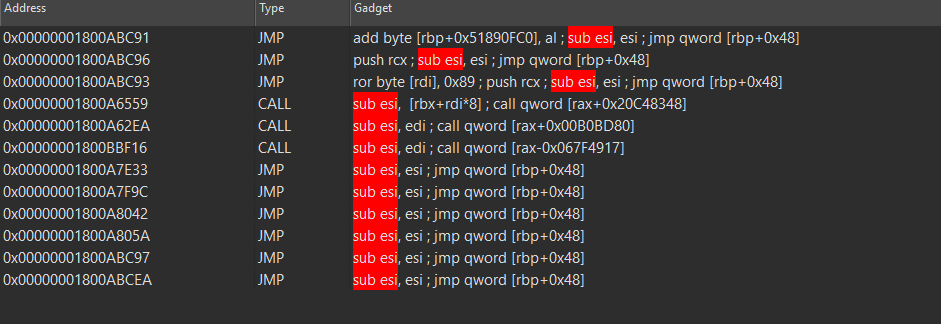
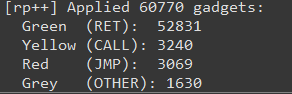

# rp++ Gadget Importer for IDA Pro

An IDA Pro plugin that imports [rp++](https://github.com/0vercl0k/rp) output and annotates gadgets directly in the disassembly view with color coding, comments, and a searchable gadget browser.

Built for exploit developers and vulnerability researchers who use rp++ for ROP gadget discovery.



*Browse, search, and jump to gadgets from a dedicated list view with type classification.*



*60,770 gadgets imported and categorized in seconds.*

## Features

- **Color-coded annotations** in the disassembly view:
  - 🟩 **Green** — `ret` gadgets (primary ROP building blocks)
  - 🟨 **Yellow** — `call` gadgets
  - 🟥 **Red** — `jmp` gadgets
  - ⬜ **Grey** — other/unclassified
- **Browsable gadget list** — sortable chooser window; click any row to jump to it in IDA
- **Repeatable comments** — full rp++ disassembly attached to each address, visible in xrefs
- **Base delta support** — handles ASLR rebasing when rp++ and IDA use different image bases
- **RET-only filter** — optionally import only `ret`-terminating gadgets
- **Import from file or clipboard** — load an rp++ `.txt` dump or paste output directly
- **Clear markings** — remove all annotations from the current import in one click
- **Context menu integration** — right-click in disassembly or pseudocode view

## Installation

### Via HCLI (recommended)

```bash
hcli plugin install rpp-gadget-importer
```

### Manual

Copy the plugin folder to your IDA plugins directory:

| OS      | Path                                       |
|---------|--------------------------------------------|
| Windows | `%APPDATA%\Hex-Rays\IDA Pro\plugins\`      |
| Linux   | `~/.idapro/plugins/`                       |
| macOS   | `~/.idapro/plugins/`                       |

```
$IDAUSR/plugins/rpp-gadget-importer/
├── ida-plugin.json
└── rpp_gadget_importer.py
```

## Usage

### 1. Generate gadgets with rp++

```bash
rp-win.exe -f target.dll -r 5 > gadgets.txt
```

### 2. Import into IDA

Three ways to access the plugin:

- **Right-click** in disassembly view → **rp++ Gadgets** submenu
- **Edit → Plugins → rp++ Gadget Importer**
- **Ctrl+Shift+R**

### 3. Context menu options

| Action                    | Description                                      |
|---------------------------|--------------------------------------------------|
| **Import from File**      | Load an rp++ `.txt` output file                  |
| **Import from Clipboard** | Paste rp++ output directly                       |
| **Browse Gadgets**        | Open the searchable gadget list; click to jump    |
| **Clear Gadget Markings** | Remove all colors and comments from current import|

### 4. Base delta

If rp++ was run with a different base address than what IDA uses (common with ASLR), you'll be prompted to enter the delta. For example, if rp++ used `0x180000000` but IDA rebased to `0x7FF600000000`:

```
delta = 0x7FF600000000 - 0x180000000 = 0x7FF480000000
```

## Expected rp++ format

The plugin parses the standard rp++ output format:

```
0x180092c0f: xor rax, rax ; ret ; (1 found)
0x18008506e: xor rax, r9 ; ret ; (1 found)
0x1800d78d2: xor rax, rax ; mov rsi, qword [rsp+0x50] ; add rsp, 0x30 ; pop rdi ; ret ; (1 found)
```

## Compatibility

- IDA Pro 9.0, 9.1, 9.2
- All platforms (Windows, Linux, macOS)
- Pure Python — no compiled dependencies

## License

MIT
